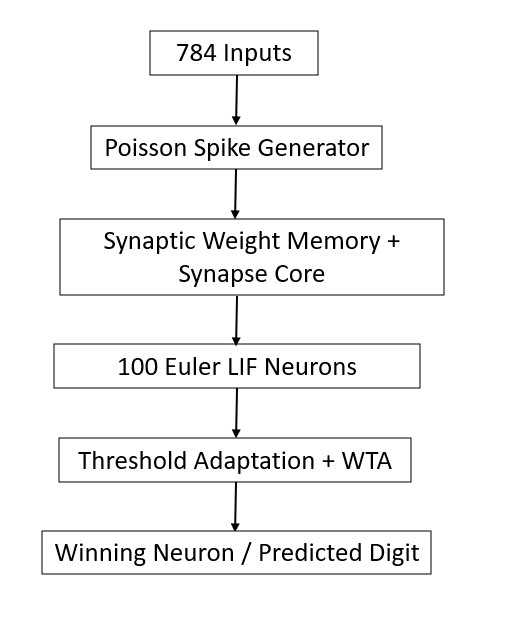
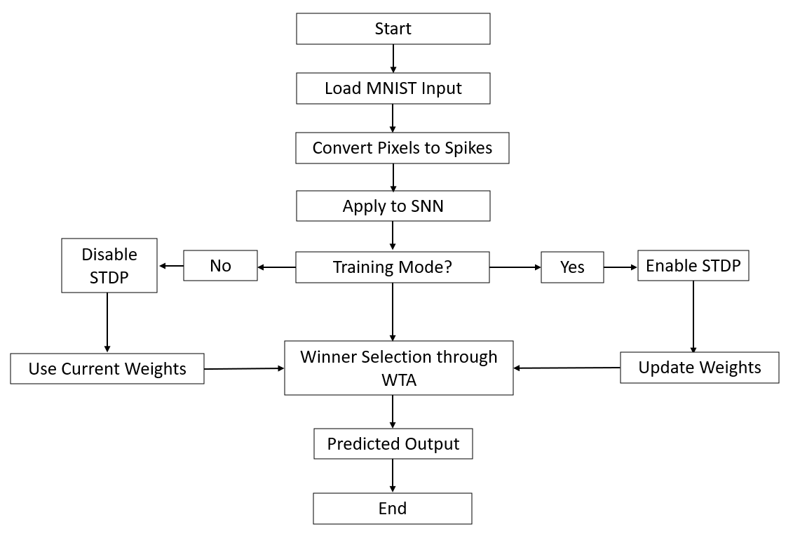
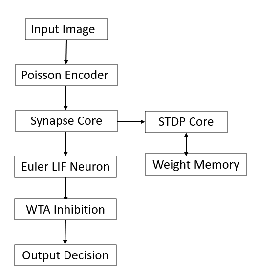
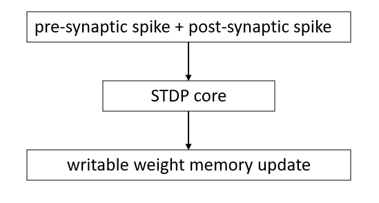
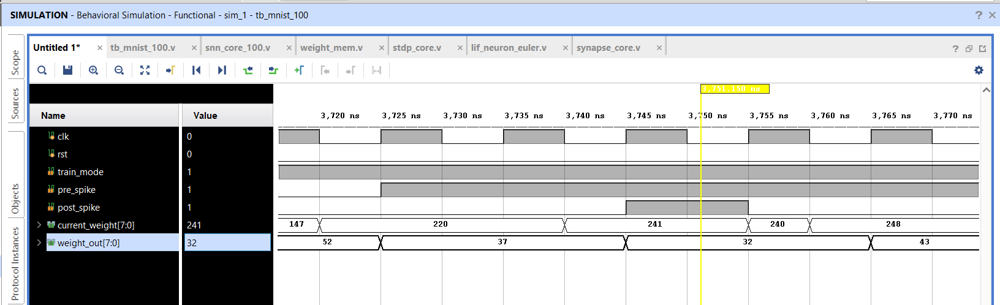
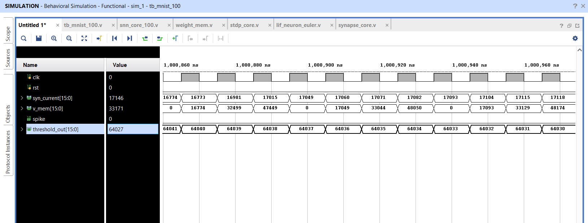
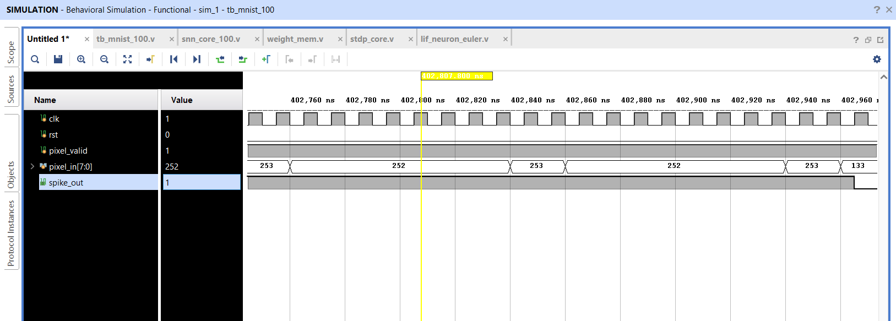
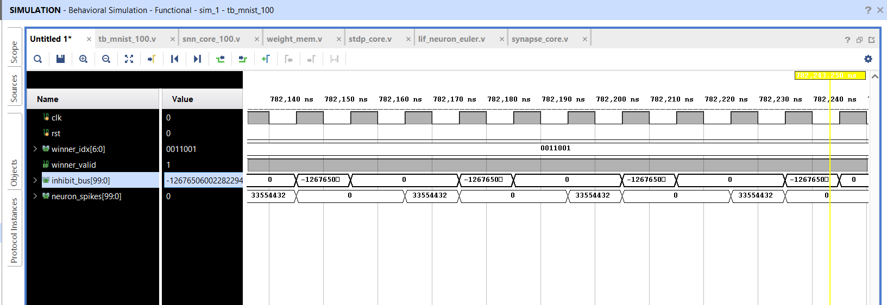

# FPGA-Based Spiking Neural Network (SNN) for MNIST Digit Recognition

## Overview

This project presents a hardware-oriented implementation of a Spiking Neural Network (SNN) accelerator using Verilog HDL for handwritten digit recognition on the MNIST dataset.

The architecture combines biologically inspired learning mechanisms with FPGA-oriented digital hardware design to create a neuromorphic computing platform capable of online learning and inference.

Key features include:

- 784-pixel MNIST input processing
- Poisson spike encoding
- Synaptic current accumulation
- Euler-based Leaky Integrate-and-Fire (LIF) neurons
- Spike-Timing-Dependent Plasticity (STDP)
- Adaptive threshold mechanism
- Winner-Take-All (WTA) inhibition
- Hardware-oriented digit classification

---

# Project Architecture

## Top-Level SNN Architecture



The system converts MNIST pixel intensities into spike trains and processes them through a network of 100 hardware neurons. Competitive learning is achieved through adaptive thresholds and Winner-Take-All inhibition.

---

## Training and Inference Flow



The architecture supports both training and inference modes.

- Training Mode: STDP enabled
- Inference Mode: STDP disabled

During training, synaptic weights are updated online. During inference, learned weights are used for digit classification.

---

## Neuron Processing Pipeline



The processing pipeline consists of:

1. MNIST Image Input
2. Poisson Spike Encoding
3. Synapse Core Processing
4. Euler-Based LIF Neuron
5. Adaptive Threshold Control
6. Winner-Take-All Competition
7. Final Digit Prediction

---

## STDP Learning Engine



The STDP engine updates synaptic weights according to the timing relationship between pre-synaptic and post-synaptic spikes, enabling online unsupervised learning directly in hardware.

---

# Design Flow

MNIST Image

↓

Poisson Spike Encoder

↓

Synapse Layer

↓

LIF Neuron Array

↓

Winner-Take-All Competition

↓

Digit Prediction

---

# Hardware Features

## Poisson Spike Generator

Converts pixel intensities into spike trains using an LFSR-based stochastic spike generation mechanism.

## Synapse Core

Implements synaptic current accumulation and exponential decay behavior.

## Euler-Based LIF Neuron

Implements:

- Membrane potential integration
- Leakage behavior
- Threshold comparison
- Spike generation
- Membrane reset

## STDP Learning Engine

Supports online weight adaptation using timing relationships between neuron spikes.

## Adaptive Threshold Module

Dynamically adjusts neuron firing thresholds to encourage competitive learning.

## Winner-Take-All (WTA)

Selects the dominant firing neuron while suppressing competing neurons through inhibition.

---

# Design Parameters

| Parameter | Value |
|------------|------------|
| Dataset | MNIST |
| Input Pixels | 784 |
| Number of Neurons | 100 |
| Encoding Method | Poisson Encoding |
| Learning Method | STDP |
| Neuron Model | Euler-Based LIF |
| Competition Mechanism | WTA Inhibition |
| RTL Language | Verilog HDL |

---

# Functional Verification

Simulation and verification were performed using Xilinx Vivado.

## STDP Weight Update



This waveform demonstrates online synaptic weight adaptation using pre-synaptic and post-synaptic spike activity.

---

## LIF Neuron Behavior



This waveform shows:

- Synaptic current accumulation
- Membrane voltage integration
- Threshold comparison
- Spike generation

---

## Poisson Spike Encoding



This waveform verifies conversion of pixel intensities into stochastic spike trains.

---

## Winner-Take-All Selection



This waveform demonstrates neuron competition, inhibition behavior, and winner selection.

---

# Technologies Used

- Verilog HDL
- Xilinx Vivado
- FPGA-Oriented RTL Design
- Digital VLSI Design
- Neuromorphic Computing

---

# Applications

- Neuromorphic Computing
- Brain-Inspired Hardware
- Edge AI Systems
- Low-Power Machine Learning
- FPGA-Based AI Accelerators
- Event-Driven Computing
- Robotics and Embedded Intelligence

---

# Repository Structure

```text
FPGA-Based-Spiking-Neural-Network-MNIST
│
├── architecture
│   ├── 01_top_level_snn_architecture.png
│   ├── 02_training_and_inference_flow.png
│   ├── 03_neuron_processing_pipeline.png
│   └── 04_stdp_learning_engine.png
│
├── src
│   ├── snn_core_100.v
│   ├── poisson_gen.v
│   ├── synapse_core.v
│   ├── lif_neuron_euler.v
│   ├── threshold_adapt.v
│   ├── stdp_core.v
│   ├── weight_mem.v
│   ├── weight_rom.v
│   └── wta_inhibit.v
│
├── waveforms
│   ├── 01_stdp_weight_update.png
│   ├── 02_lif_neuron_behavior.png
│   ├── 03_poisson_spike_encoding.png
│   └── 04_wta_winner_selection.png
│
└── README.md
```

---

# Key Learnings

- Hardware implementation of Spiking Neural Networks
- FPGA-oriented AI accelerator design
- Online learning using STDP
- Competitive learning using WTA
- Neuromorphic hardware architectures
- Digital verification using Vivado
- Hardware-efficient neuron modeling

---

# Future Improvements

- FPGA deployment on Xilinx hardware platforms
- Larger neuron populations
- Convolutional SNN architectures
- SystemVerilog/UVM verification
- ASIC implementation flow
- Hardware performance optimization

---

# Author

## Dinesh Vardhan Dundi

B.Tech – Electronics and Communication Engineering

### Research Interests

- VLSI Design
- Digital IC Design
- FPGA Design
- ASIC Design
- Neuromorphic Computing
- AI Hardware Accelerators
- Hardware Architecture
